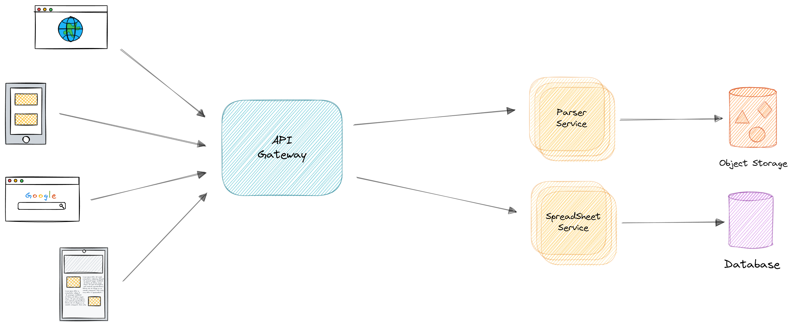
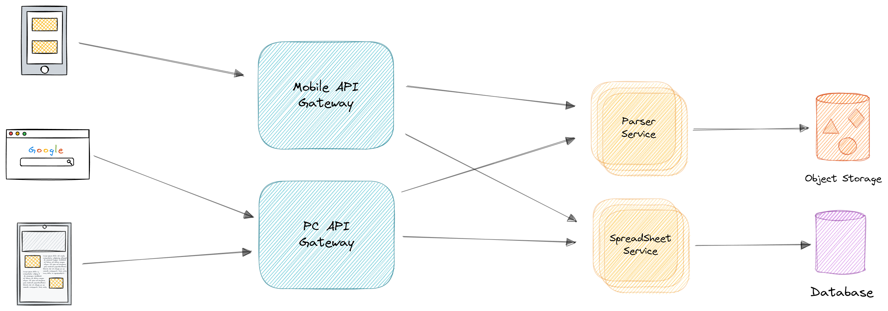
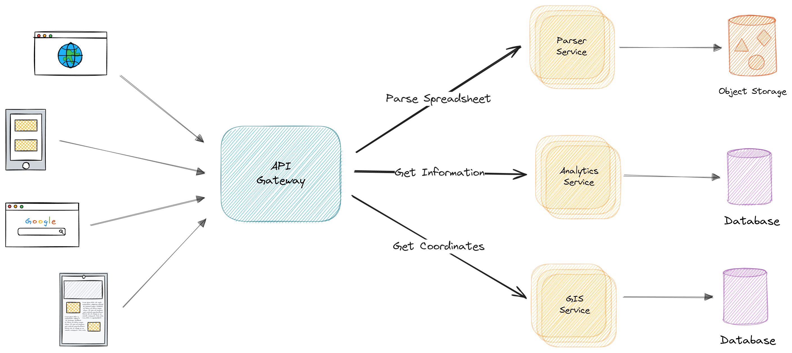

## API Gateway. Маршрутизация и фильтрация

В нынешних стандартах информационных технологий существует понятие цифровой экосистемы, требующей
эффективной обработки и управления потоком данных. В контексте цифровой экосистемы появляется
надобность в инструментарии, способном на рационализацию и организацию потока данных между
клиентами и целевыми микросервисами. API Gateway становится одним из важных решений в данном
контексте.

API Gateway - инструмент, предоставляющий функциональность машрутизации, фильтрации и авторизации
трафика. Он является одним из важных компонентов в рамках микросервисной архитектуры,
способствующий организации внутренних и внешних взаимодействий между компонентами системы.

### Прямое взаимодействие клиента и сервиса

В контексте современных подходов к разработке миркосервисных платформ в некоторых случаях
рассматривается возможность прямого взаимодействия клиента с микросервисом. Этот подход
предполагает, что клиентское приложение
способно напрямую отправлять запросы к отдельным микросервисам без посредника между ними. В данном
сценарии, каждый микросервис предоставляет общедоступный эндпоинт, часто с индивидуальным
TCP-портом, что обеспечивает прямой доступ к конкретному сервису.

При таком подходе первостепенно возникает необходимость в прозрачном механизме для управления
трафиком и обеспечения безопасности
взаимодействия между клиентом и микросервисами. В данном контексте, могут быть задействованы
дополнительные
инструменты, например балансировщики нагрузки или ADC, которые помогают
обеспечить не только равномерное распределение запросов между микросервисами, но и обеспечивают
уровень базовый уровень защиты, к примеру использование при запросах
протокола SSL для шифрования соединения.

Однако, при создании масштабных приложений на основе микросервисов, особенно при взаимодействии с
удаленными мобильными приложениями или веб-приложениями SPA, сталкиваются с
рядом множественных вызовов. При увеличении системы
вызовы требуют минимизации обращений к серверной части для сокращений задержки обращения и расходов
на эксплотацию,
управление сквозными задачами, такими как авторизация и безопасность, а также создание
специализированных дополнительных фасадов для оптимизации работы и разделение бизнес-логики для
различных типов клиентских приложений.

Следовательно, в контексте архитектуры прямого взаимодействия клиент-микросервис, важно учитывать не
только технологические аспекты, но и сложившиеся практики и вызовы, с которыми сталкиваются
разработчики при проектировании и развертывании современных цифровых приложений.

Пример прямой связи клиента и сервиса представлен на рисунке

#### Проблемы подхода

Следует учитывать, что при прямом соединении клиента и отдельных сервисов нелинейно увеличивается
сложность взаимодействия и управления. Связанно это с необходимостью поддержания соединения с
клиентом на протяжении всего запроса, что потенциально увеличивает нагрузку на ресурсы сети.

Ко всему такой подход несет серьезные проблемы с безопасностью, так как отсутствует
централизированный
механизм контроля аунтефикации. Эта проблема несет за собой, в том числе и проблемы поддержания
единого соглашения политики безопасности сервиса из-за необходимости каждого отдельного сервиса
обеспечивать собственную безопасность.

Наконец, прямое взаимодействие усложняет обновление и масштабирование системы. При внесении
изменений в микросервисы или добавлении новых компонентов необходимо обновлять каждое клиентское
приложение, что может быть трудоемким и время затратным процессом.

### API Gateway

Шаблон API Gateway представляет собой концепцию, используемую при разработке и архитектуре
масштабных или комплексных приложений, основанных на архитектуре микросервисов и включающих
несколько клиентских приложений. В контексте данной практики API Gateway представляет собой сервис,
который функционирует как централизованная точка входа для определенных кластеров микросервисов.
Этот шаблон, аналогичный концепции фасада в объектно-ориентированном проектировании, является
составной частью децентрализованных систем.

Следовательно, API Gateway размещается между клиентскими приложениями и микросервисами, действуя в
качестве обратного прокси-сервера, который маршрутизирует запросы от клиентов к соответствующим
сервисам. Тем не менее API Gateway обеспечивает дополнительную функциональность, такую как
аутентификация, SSL и кэширование.

На рисунке ( представлена диаграмма, иллюстрирующая интеграцию
пользовательского
API Gateway в упрощенную схему архитектуры микросервисов.

Важно подчеркнуть, что в представленной схеме используется единый пользовательский сервис API
Gateway, обслуживающий несколько различных клиентских приложений. Это может представлять риск в
плане масштабирования и поддержки, так как сервис API Gateway становится весьма сложным из-за
разнообразных требований клиентских приложений. Это может привести к его увеличению и, в конечном
итоге, превращению в монолитное приложение или сервис. Следовательно, рекомендуется разделение API
Gateway на несколько служб или отдельных API Gateways в соответствии с бизнес-границами и
потребностями клиентских приложений.

Разработка и реализация API Gateway требует осторожного подхода. Объединение всех внутренних
микросервисов приложения в единый API Gateway может привести к нарушению автономии микросервисов и
созданию архитектурного оркестратора, что не рекомендуется.

#### BFF

При разделении уровня API Gateway на несколько компонентов, например, при наличии нескольких
клиентских приложений, основным руководством является создание различных эндпоинтов API Gateways в
соответствии
с типами клиентов. Это может быть реализовано через применение шаблона "Серверная часть для
интерфейса" (BFF), где API Gateway предоставляет специализированный API для конкретного типа
клиентского приложения. 

Для платформ, использующих множество сервисов, важность применения агрегации возрастает, так как
требуется объединение нескольких низкоуровневых вызовов для обеспечения пользовательских функций. В
таких сценариях один вызов к шлюзу для фронтендов (BFF) обычно порождает ряд низкоуровневых вызовов
к разным микросервисам. Примером может послужить приложение для аналитики исторических данных, в
котором
пользователь требует получения списка координат церквей из определенного уезда для визуализации
движения рукописи
за определенный период времени.

С точки зрения оптимизации ресурсов было бы целесообразно осуществлять как можно больше вызовов
параллельно. После завершения начального вызова к сервису "Поиска координат" оптимально выполнять
вызовы других сервисов параллельно, с целью сократить общее время обработки. [10](Литература.md#bff)

### Spring Cloud Gateway

Для проекта платформы аналитики исторических данных перед API Gateway выдвигаются определенные
требования:

1) Должен маршрутизировать запросы в различные модификации сервисов в зависимости от клиента.
2) Поддержка Oauth 2.0 для передачи информации о пользователи в API сервисы
3) Метрики для оценки загрузки сервиса и задержки ответов.
4) Логирование запросов и ответов.

Под выбранные цели и возможности команды был выбран Spring Cloud Gateway.
Он предоставляет механизмы для гибкой маршрутизации запросов в различные модификации сервисов в
зависимости от требований клиента. Это осуществляется с помощью конфигурации маршрутов, что
обеспечивает высокую гибкость и адаптивность системы к изменяющимся потребностям. Встроенная
поддержка OAuth 2.0 в Spring Cloud Gateway обеспечивает безопасную передачу информации о
пользователе между клиентом и API сервисами. Spring Cloud Gateway предоставляет возможности для
сбора и анализа метрик, позволяя команде оценивать загрузку сервиса и задержки ответов. Отсюда
следует обоснование выбора Spring Cloud Gateway обоснован для достижения поставленных целей и
обеспечения требуемых функциональных возможностей.

Тем не менее его основное преймущество -- работа в режиме non-blocking.

#### Non-blocking Spring Cloud Gateway

Неблокирующая схема, реализованная вне контекста сервлетов и функционирующая на основе Netty,
основанного на проекте Reactor, представляет собой асинхронный фреймворк, ориентированный на event
loop'ы, а не на статически определенное количество потоков. В данной схеме может
присутствовать только один поток. Каждый процессорный поток управляет одной петлей, в которой
сосредоточены каналы, принимающие входящие TCP-соединения, декодирующие HTTP-запросы (это происходит
быстро) и передающие их дальше.

Запрос поступает через HTTP в канал, затем через петлю событий и далее в приложение WebFlux (
реактивный подход к написанию приложений Spring, основанный на Project Reactor) в виде объекта
ServerHttpRequest - нового объекта, заменяющего HttpServletRequest. Это происходит неблокирующим
образом: петля событий получает событие из канала, обрабатывает его, создает флаг ожидания
ответа, отправляет его дальше по цепочке и готова снова принимать запросы. WebFlux оборачивает его в
ServerWebExchange, который содержит в себе и запрос, и ответ, и передает их дальше по цепочке до
WebClient - того же HttpClient, но способного работать асинхронно.

Таким образом, получается аналог контекста сервлетов, но уже работающий в неблокирующем режиме, с
использованием реактивных операторов. Ко всему же, все происходит асинхронно, так что даже при
наличии только одного процессорного потока все будет
функционировать. [11](Литература.md#spring-cloud-gateway)

#### Circuit breaker pattern

В процессе обработки запросов микросервсисы часто взаимодействуют друг с другом. Когда один сервсис
синхронно вызывает другой, существует вероятность того, что второй сервис будет недоступна или его
задержка будет настолько велика, что пользование им станет практически невозможным. Это может
привести к неэффективному использованию ресурсов, например, потоков, которые могут быть
заблокированы вызывающей стороной в ожидании ответа от другой службы. Такие ситуации могут привести
к истощению ресурсов и, в конечном итоге, вызвать неспособность обработки других запросов вызывающей
службой. Кроме того, сбой одной службы может потенциально повлиять на работу других служб в рамках
всего приложения. [12](Литература.md#circuit-breaker)

Встает вопрос о необходимости предотвращения распространения сбоев одних сервисов на другие.

Для обеспечения взаимодействия клиента службы с удаленной службой необходимо использовать
прокси-сервер, функционирующий по аналогии с электрическим выключателем. При достижении
определенного порогового значения последовательных сбоев происходит автоматическое срабатывание
выключателя. В течение установленного периода ожидания все попытки обращения к удаленной службе
завершаются неудачей. По истечении данного времени автоматический выключатель пропускает
ограниченное количество тестовых запросов. В случае успешного завершения данных запросов выключатель
восстанавливает нормальный режим работы. Однако, если тестовые запросы завершаются неудачно,
происходит повторный запуск периода ожидания, и цикл
возобновляется. [13](Литература.md#microservice-pattern)

Такой подход имеет и минусы из-за неправильного подбора значения тайм-аута из-за чего в следствии
создаются ложные срабатывания и дополнительные задержки.
