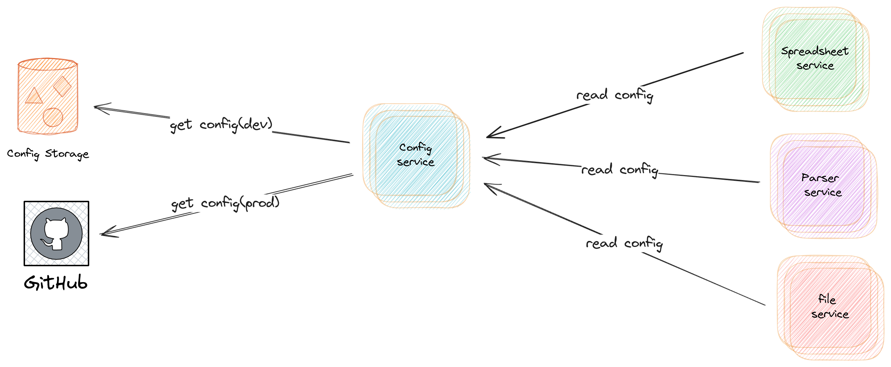

# Внедрение сервера конфигурации для инфраструктуры микросервисов

Внедрение сервера конфигурации в инфраструктуру микросервисов обладает значительной важностью, что обусловлено рядом
факторов, влияющих на стабильность, управляемость и масштабируемость систем.

Во-первых, сервер конфигурации позволяет централизованно управлять настройками множества микросервисов. В условиях,
когда каждый микросервис может иметь свои уникальные параметры, централизованное управление конфигурациями обеспечивает
консистентность и согласованность между различными компонентами системы. Это особенно критично в распределенных
системах, где конфигурационные изменения должны оперативно и синхронно применяться ко всем компонентам.

Во-вторых, централизованное хранение конфигураций облегчает процесс обновления и развертывания микросервисов. Внедрение
сервера конфигурации позволяет динамически изменять параметры конфигурации без необходимости перезапуска самих
микросервисов. Это сокращает время простоя системы и повышает её доступность, что важно для бизнес-критичных приложений.

В-третьих, сервер конфигурации улучшает безопасность системы. Конфиденциальные данные, такие как ключи API и пароли,
могут храниться в зашифрованном виде и предоставляться только авторизованным микросервисам. Это снижает риск утечек
данных и упрощает управление доступом к чувствительной информации.

Четвертое значительное преимущество - улучшение масштабируемости. С ростом количества микросервисов и их экземпляров,
управление конфигурацией становится всё более сложной задачей. Сервер конфигурации позволяет легко масштабировать
системы, обеспечивая быстрый и гибкий доступ к необходимым параметрам конфигурации независимо от числа микросервисов.

Наконец, внедрение сервера конфигурации способствует лучшей отслеживаемости и управляемости изменений конфигураций.
Введение версионирования конфигурационных файлов позволяет отслеживать историю изменений, что облегчает диагностику и
устранение неполадок. Это обеспечивает прозрачность и контроль над изменениями в системе, что важно для поддержания её
стабильности и надежности.

Таким образом, сервер конфигурации является одним из ключевых компонентов современной архитектуры микросервисов,
способствующим
повышению эффективности управления, безопасности, масштабируемости и стабильности системы.

## **Выбор сервера конфигурации**

### Критерии выбора сервера конфигурации

При выборе сервера конфигурации для платформы анализа исторических данных необходимо учитывать ряд ключевых критериев,
которые помогут обеспечить надежную и эффективную работу всей инфраструктуры.

Первым критерием можно выделить необходимость в высокой доступности, то есть сервис должен обладать механизмами
автоматического
восстановления и способностью к горизонтальному масштабированию, чтобы минимизировать время простоя.
Следующим фактором при выборе должна быть способность обеспечения минимальных задержек при доступе к конфиг файлам,
а также возможность поддержки различных форматов файлов, например `json`, `yaml` и другие.

Не стоит забывать и про лицензию для использования. Необходимо перед использованием ознакомиться с условиями
лицензирования и возможностью использования сервера конфигурации в коммерческих и некоммерческих проектах.

Также должны поддерживаться методы шифрования конфигураций как в состоянии потока, так и при передаче.

Опциональным условием будет наличие активного сообщества разработчиков у проекта, потому наличие такого сообщества,
способно предоставить обновление или улучшение продукта.

### Сравнение популярных решений

Для сравнения популярных решений для управления конфигурацией и сервисами в распределённых системах рассмотрим три
наиболее часто используемых инструмента: Consul, etcd и Spring Cloud Config. Каждый из этих инструментов имеет свои
особенности, преимущества и недостатки, которые будут проанализированы в данной теме.

#### Consul

**Описание:**
Consul — это распределённая система управления конфигурациями, обнаружения сервисов и организации сервисной сети (
service mesh), разработанная компанией HashiCorp. Consul предоставляет функционал для регистрации сервисов, проверки их
состояния, распределённого хранения конфигураций и автоматизации сетевого взаимодействия между сервисами.

**Преимущества:**

1. **Обнаружение сервисов:** Consul автоматически обнаруживает и регистрирует сервисы, что облегчает управление сложными
   инфраструктурами.
2. **Проверка состояния:** Встроенные механизмы health-check позволяют отслеживать состояние сервисов в реальном
   времени.
3. **Ключ-значение хранилище:** Consul использует KV-хранилище для распределённого хранения конфигураций.
4. **Service Mesh:** Consul поддерживает функции сервисной сети, включая управление сетевыми политиками и мидлварное
   шифрование.

**Недостатки:**

1. **Сложность настройки:** Конфигурация и интеграция Consul может быть сложной, особенно в больших кластерах.
2. **Ресурсоёмкость:** Требования к ресурсам для поддержания Consul-кластера могут быть высокими, что ограничивает его
   использование в небольших проектах.

#### etcd

**Описание:**
etcd — это распределённое хранилище конфигураций, ориентированное на консенсус, разработанное CoreOS. Оно используется в
различных системах, таких как Kubernetes, для хранения конфигурационных данных и метаданных.

**Преимущества:**

1. **Согласованность данных:** etcd обеспечивает строгое согласование данных благодаря алгоритму Raft.
2. **Высокая производительность:** Высокая производительность и низкая задержка доступа к данным.
3. **Простота:** Простая и лёгкая в использовании API для операций с данными.
4. **Интеграция с Kubernetes:** Является основным хранилищем конфигураций для Kubernetes, что обеспечивает глубокую
   интеграцию и стабильность.

**Недостатки:**

1. **Ограниченный функционал:** В отличие от Consul, etcd не предоставляет встроенные механизмы для обнаружения сервисов
   и проверки их состояния.
2. **Сложность управления:** Управление кластером etcd требует тщательного планирования и мониторинга, особенно в
   больших масштабах.

#### Spring Cloud Config

**Описание:**
Spring Cloud Config — это инструмент для управления конфигурациями в облачных приложениях, входящий в экосистему Spring.
Он позволяет централизованно управлять конфигурационными файлами и изменениями конфигураций для различных приложений.

**Преимущества:**

1. **Интеграция с Spring:** Глубокая интеграция с экосистемой Spring облегчает использование в Spring-приложениях.
2. **Централизованное управление:** Позволяет централизованно управлять конфигурациями для множества приложений.
3. **Поддержка версионирования:** Интеграция с системами контроля версий (такими как Git) позволяет отслеживать
   изменения конфигураций и возвращаться к предыдущим версиям.

**Недостатки:**

1. **Ограниченная функциональность:** Основной фокус на управление конфигурациями, без дополнительных функций, таких как
   обнаружение сервисов или управление сетями.
2. **Зависимость от Spring:** Оптимизирован для использования в Spring-приложениях, что может ограничивать его
   применение в других технологиях.

### Сравнительный анализ

**Функциональные возможности:**

- Consul предлагает наиболее широкий спектр возможностей, включая обнаружение сервисов, проверку их состояния и
  управление сетевой политикой.
- etcd специализируется на высокопроизводительном, согласованном хранении данных.
- Spring Cloud Config фокусируется на управлении конфигурациями в приложениях, интегрированных с Spring.

**Простота использования:**

- Spring Cloud Config является наиболее простым в использовании для разработчиков, работающих с экосистемой Spring.
- Consul и etcd требуют более сложной настройки и управления, особенно в крупных кластерах.

**Производительность и масштабируемость:**

- etcd демонстрирует высокую производительность и низкую задержку, что делает его предпочтительным для хранения
  критически важных данных.
- Consul и Spring Cloud Config могут иметь более высокие накладные расходы в зависимости от используемых функций и
  архитектуры.

### Заключение

Выбор инструмента для управления конфигурациями и сервисами в распределённых системах зависит от конкретных требований
проекта и архитектуры системы. Consul подходит для комплексных систем с необходимостью управления сетевой политикой и
обнаружения сервисов. etcd является оптимальным выбором для высокопроизводительного и надёжного хранения данных. Spring
Cloud Config идеален для централизованного управления конфигурациями в Spring-приложениях.

### Анализ требований и особенностей проекта

Проект предполагает создание платформы для анализа исторических данных, рассчитанной на целевую аудиторию
преймущественно исследователей,
следуя из этого можно сделать предположение о среднемесячной нагрузки на платформу. Благодаря этому можно сделать выбор
в пользу того или иного продукта.
Дополнительной особенностью на данной стадии проекта является разработка преимущественно на языке `Java`
и фреймворке `Spring boot`.

Исходя из особенностей проекта выбор был сделан в пользу Spring Cloud Config. Потому что Spring Cloud Config легко
интегрируется с другими компонентами Spring, такими как Spring Boot и Spring Security, что упрощает разработку и
развертывание приложения. Он так же позволяет централизованно управлять конфигурациями всех сервисов, что
упрощает администрирование и поддержание консистентности конфигураций. Возможность динамически изменять конфигурации без
необходимости перезапуска сервисов позволяет оперативно реагировать на изменения требований и условий эксплуатации

## **Проектирование архитектуры сервера конфигурации**

Проектирование архитектуры сервера конфигурации позволяет централизованно управлять конфигурационными данными,
обеспечивая их консистентность и безопасность. Это упрощает администрирование, повышает надежность системы и позволяет
быстро адаптироваться к изменениям без необходимости перезапуска приложений.

### Схема взаимодействия компонентов

В ходе работы была спроектированная схема, представленная на рисунке

Благодаря такому подходу мы можем разделить конфигурации для
среды разработки приложения и настоящей.

### Безопасность и контроль доступа

Spring Cloud Config предоставляет возможности для реализации различных механизмов безопасности и контроля доступа,
которые обеспечивают защиту конфигурационных данных от несанкционированного доступа и изменений.
Аутентификация пользователей и сервисов, получающих доступ к Spring Cloud Config, является первым шагом в обеспечении
безопасности. Spring Cloud Config поддерживает различные методы аутентификации.
Он из "коробки" интегрируется с различными провайдерами OAuth2, такими как Auth0, Okta, Keycloak.

Защита конфиденциальных конфигурационных данных, таких как учетные данные и ключи API, осуществляется с помощью
шифрования.
Spring Cloud Config поддерживает шифрование конфиденциальных значений в конфигурационных файлах. Для этого используются
такие инструменты, как JCE (Java Cryptography Extension) и внешние сервисы шифрования (например, HashiCorp Vault).
Использование TLS (Transport Layer Security) для шифрования данных при передаче между клиентами и сервером Spring Cloud
Config, что защищает данные от перехвата и манипуляций.

### Репликация и отказоустойчивость

Для обеспечения отказоустойчивости Spring Cloud Config Service следует применять несколько стратегий:
Развертывание нескольких экземпляров Spring Cloud Config Server в кластерной конфигурации с использованием
балансировщика нагрузки, который будет распределять запросы между доступными
экземплярами. Это обеспечивает устойчивость к сбоям отдельных узлов.
Использование нескольких зеркальных копий конфигурационных хранилищ (Git-репозиториев или баз данных) с автоматическим
переключением на доступный репозиторий в случае сбоя основного хранилища.
Локальное кеширование конфигурационных данных на уровне клиентских приложений с использованием механизма Spring Cloud
Config Client. В случае недоступности конфигурационного сервера клиент может временно использовать закешированные
данные.

## **Интеграция сервера конфигурации с микросервисами**

### Настройка подключения микросервисов к серверу конфигурации

### Методы получения и обновления конфигурации

## **Управление конфигурацией и версионирование**

### Практики версионирования конфигурационных данных

### Инструменты для управления версиями

### Автоматизация обновлений и деплоймента

## **Мониторинг и аудит конфигурации**

### Инструменты мониторинга состояния конфигурации

### Журналирование изменений конфигурационных данных

### Анализ и отчетность по изменениям

## **Обеспечение безопасности конфигурационных данных**

### Шифрование конфигурационных данных

### Аутентификация и авторизация пользователей и сервисов

### Управление ключами и секретами

## **Заключение и перспективы развития**

### Оценка эффективности внедрения сервера конфигурации

### Потенциальные улучшения и новые технологии

### Будущее управления конфигурацией в микросервисах