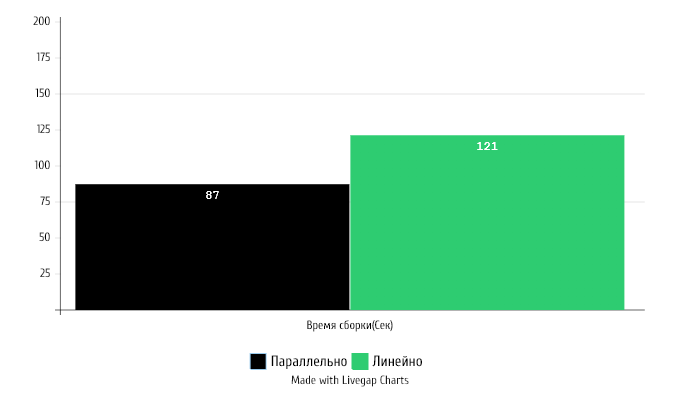
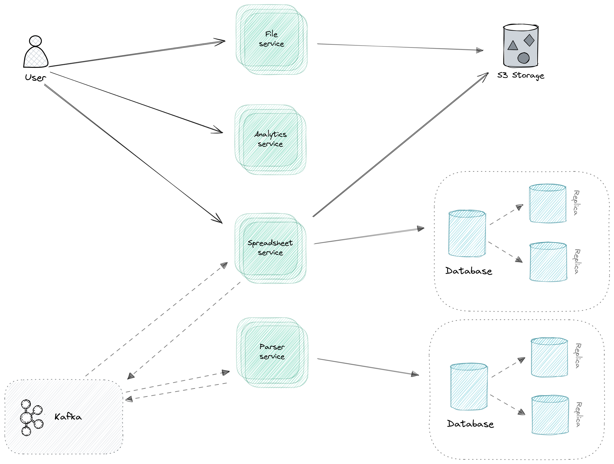
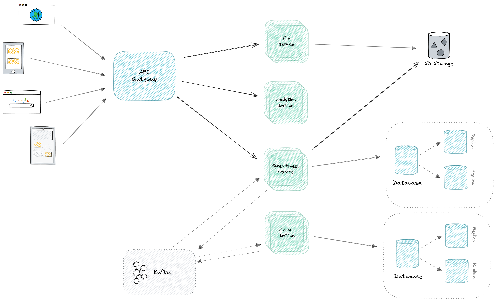
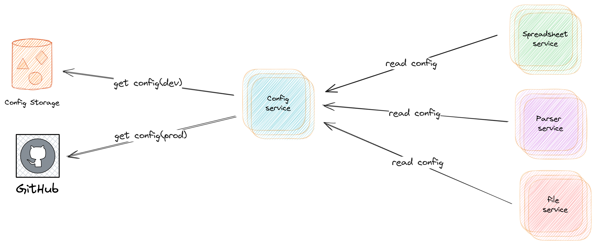

# Практическая часть

## Интеграция системы автоматической сборки Gradle

### Организация проекта Gradle для проекта аналитики исторических данных

Структурирование исходного кода и процесса сборки программных проектов играют важную роль в
обеспечении их читаемости и управляемости. На основе накопленного опыта были выработаны оптимальные
методики, способствующие достижению этих целей. В данном разделе рассматриваются эффективные
практики организации проектов, направленные на обеспечение их структурной ясности и удобства
сопровождения. Также анализируются распространенные проблемы, с которыми сталкиваются разработчики,
и предлагаются методы их предотвращения.

#### Разделение файлов исходного кода для определенных языков

Плагины для языка Gradle устанавливают определенные соглашения относительно организации и обработки
исходного кода проекта. Например, при использовании языка программирования Java проект автоматически
компилирует
свой исходный код, расположенный в каталоге `src/main/java`. Аналогично, плагины для других языков
следуют подобной схеме, определяя местоположение исходных файлов в соответствии с соответствующими
соглашениями.[3](/additionally/Литература.md#plugin-java)

Некоторые компиляторы способны осуществлять кросс-компиляцию для нескольких языков, используя единый
каталог для хранения исходных файлов. В контексте оптимизации производительности сборочных
процессов, Gradle рекомендует строго соблюдать
разделение исходных файлов по языкам программирования, что облегчает как процесс сборки, так и
обеспечивает четкость в предполагаемых структурах
проекта. [4](/additionally/Литература.md#organizing-gradle-project)

Представленная структура исходного кода включает в себя отдельные каталоги для файлов на Java и
Kotlin. Файлы на Java размещаются в каталоге `src/main/java`, в то время как файлы на Kotlin
хранятся
в каталоге `src/main/kotlin`.

```
├── build.gradle.kts
└── src
    └── main
        ├── java
        │   └── ParserControlller.java
        └── kotlin
            └── SocketUtils.kt
```

#### Тестирование

В рамках программного проекта часто требуется проведение разнообразных видов тестирования, таких как
модульные, интеграционные, функциональные и smoke тесты. Для эффективного управления исходным
кодом каждого типа теста рекомендуется его хранение в специально выделенных каталогах. Практика
размещения тестового кода в отдельных каталогах положительно сказывается на удобстве сопровождения
проекта и разделении обязанностей, поскольку позволяет запускать различные типы тестов независимо
друг от друга. Такой подход способствует повышению гибкости и эффективности процесса разработки,
облегчая выявление и устранение дефектов в приложении. [5](/additionally/Литература.md#test-gradle)

В частности, мы добавляем плагин соглашения, чтобы `buildSrc` разделить настройку интеграционного
теста между несколькими подпроектами:

```kotlin
//...
val integrationTestTask = tasks.register<Test>("integrationTest") {
    description = "Runs integration tests."
    group = "verification"
    useJUnitPlatform()

    testClassesDirs = integrationTest.output.classesDirs
    classpath = configurations[integrationTest.runtimeClasspathConfigurationName] + integrationTest.output

    shouldRunAfter(tasks.test)
}
//...
```

Применение в проекте конкретного приложения:

```kotlin
dependencies {
    implementation(project(":list"))
}
```

#### Стандартные соглашения

Все встроенные плагины в Gradle придерживаются стандартных соглашений в области конфигурации в
рамках парадигмы разработки программного обеспечения. Логика каждого плагина предоставляет
пользователям разумные значения по умолчанию и устанавливает стандарты и соглашения в определенном
контексте.

Соглашение о конфигурации (также известное как кодирование по соглашению) — это парадигма
проектирования программного обеспечения, используемая программными платформами, которая пытается
уменьшить количество решений, которые разработчик, использующий структуру, должен принимать, не
теряя при этом гибкости и не повторяясь (DRY)
принципы. [6](/additionally/Литература.md#programming-in-ruby-a-critical-look-at-the-pros-and-cons)

Java плагин определяет каталог src/main/java в качестве исходного каталога по умолчанию для
компиляции кода.

Выходной каталог для скомпилированного исходного кода и других артефактов
устанавливается в каталог build.

Соблюдение стандартных соглашений по умолчанию позволяет новым разработчикам проекта быстро
ориентироваться в его структуре.

#### Использование `buildSrc` для инкапсуляции императивной логики

Для абстрагирования императивной логики в процессе сборки рекомендуется использовать
механизм `buildSrc`. Комплексная логика сборки часто является целесообразным кандидатом для
инкапсуляции в виде пользовательской задачи или двоичного плагина. Реализации таких пользовательских
задач и плагинов не следует размещать внутри сценариев сборки. Использование `buildSrc` для этой
цели является предпочтительным, поскольку это позволяет избежать повторного использования кода в
различных независимых проектах.

Каталог `buildSrc` рассматривается как встроенный проект сборки. При обнаружении этого каталога
Gradle автоматически компилирует и тестирует его содержимое, а затем включает скомпилированные
классы в путь вашего сценария сборки. Для многопроектных сценариев сборки может быть только один
каталог `buildSrc`, который должен располагаться в корневом каталоге проекта. Важно отдавать
предпочтение использованию плагинов сценариев, так как они обеспечивают более простое обслуживание,
рефакторинг и тестирование
кода. [7](/additionally/Литература.md#sharing-build-logic-between-subprojects-sample)

### Управление зависимостями и плагинами в Gradle

В проекте дополнительно используется механизм централизованного управления расширением зависимостей.
Модуль позволяет указать источник версий зависимостей для каталога `libs`. В данном случае он
указывает на файл `libs.versions.toml`,
содержащий информацию о версиях зависимостей.

```kotlin
dependencyResolutionManagement {
    versionCatalogs {
        create("libs") {
            from(files("configuration/libs.versions.toml"))
        }
    }
}

include("conventions")
```

В качестве основного языка для Gradle был выбран Kotlin из-за схожести синтаксиса с Java.
В данном случае, плагин kotlin-dsl включается для использования Kotlin DSL в качестве основного
языка для написания сборочных скриптов в Gradle во всем проекте.

Плагин Spring Boot Gradle обеспечивает поддержку Spring Boot в Gradle . Он позволяет упаковывать
исполняемые jar, запускать приложения Spring Boot и использовать управление
зависимостями,
предоставляемое `spring-boot-dependencies`. [8](/additionally/Литература.md#справочное-руководство-по-плагину-spring-boot-gradle)

```kotlin
plugins {
    `kotlin-dsl`
}

dependencies {
    implementation(libs.spring.boot.gradle.plugin)
}
```

В представленном кодовом отрывке, переменная versionCatalog получает доступ к расширению
VersionCatalogsExtension и идентифицирует именованный каталог версий с названием "libs".

Метод api(platform(project(":platform"))) добавляет зависимость от платформы проекта с именем ":
platform". Это указывает на то, что весь проект будет использовать версии зависимостей, определенные
в данной платформе.

```kotlin
val versionCatalog = extensions.getByType<VersionCatalogsExtension>().named("libs")
dependencies {
    api(platform(project(":platform")))

    versionCatalog.findLibrary("lombok").ifPresent {
        compileOnly(it)
        annotationProcessor(it)
    }
}
```

Такой подход способствует стандартизации и упрощает управление зависимостями, особенно в
масштабируемых и многоуровневых проектах.

### Создание пользовательских задач и скриптов в Gradle

В проекте используется несколько пользовательских задач, переопределяющих стандартное поведение
Gradle.

Директива `manifest { ... }` определяет настройки манифеста, который содержит метаданные о проекте.
В данном контексте устанавливаются атрибуты манифеста, такие как "Implementation-Title" (название
реализации) и "Implementation-Version" (версия реализации), которые присваиваются соответственно
имени и версии проекта.

```kotlin
tasks.jar {
    manifest {
        attributes(
                mapOf(
                        "Implementation-Title" to project.name,
                        "Implementation-Version" to project.version
                )
        )
    }
}
```

### Оптимизация процесса сборки с использованием Gradle

Эффективность процесса сборки играет решающую роль в производительности разработки. Увеличение
времени сборки повышает риск прерывания рабочего процесса. Учитывая, что сборки запускаются
многократно в течение дня, даже небольшие задержки могут существенно
накапливаться. [9](/additionally/Литература.md#gradle-perfomance)

#### Параллельное выполнение сборки

Так как проект состоит более чем из одного подпроекта линейная сборка занимает значительное время
из-за не равносильности подпроектов. Так как из-за микросервисной архитектуры подпроекты независимы
друг от друга, то они не имеют общего состояния. В таком случае есть смысл заставить Gradle
выполнять сборку подпроектов параллельно.

Для этого в проекте используется флаг:

```kotlin
org.gradle.parallel = true
```

Результаты оптимизации представлены на рисунке:


Прирост производительности автоматизированной сборки составил 21 %.

## Гейтвей (нужно расписать про проект)

### Анализ требований и постановка задач

Проект начинается с определения основных требований к системе, включая:

- Обеспечение высокодоступного и отказоустойчивого доступа к данным.
- Масштабируемость для обработки большого объема запросов.
- Безопасность и защита данных.
- Гибкость маршрутизации и обработки запросов.

### Основные компоненты архитектуры

Архитектура системы включает следующие основные компоненты:

- Spring Cloud Gateway: Центральный элемент для маршрутизации запросов и применения политик безопасности.
- Микросервисы: Каждый микросервис отвечает за конкретные функции, такие как обработка данных, управление
  пользователями, генерация отчетов и т.д.
- Базы данных: Хранение структурированных и неструктурированных данных о православных объектах, исторической информации
  и т.д.
- Интерфейсы пользователя: Веб-приложения и мобильные приложения для взаимодействия с пользователями.

### Описание архитектуры проекта до внедрения Spring Cloud Gateway.

До внедрения API gateway в проект аналитики исторических данных все запросы маршрутизировались напрямую каждому
микросервису.

За собой это влекло ряд трудностей, которые требовали решения. Первостепенно - это вопрос безопасности.
Прямой доступ значительно повышает вероятность потенциальных угроз. Дополнительно это усложняет соблюдение единой
политики безопасности.

Следующей трудностью оказалось версионированние API. У каждого микросервиса есть свой эндоинт, в том числе даже в
рамках одного сервиса существуют разные версии конечной точки. Возникала проблема доступа к разным версиями API.

Таким образом, отсутствие API Gateway приводило к множеству организационных и технических проблем, которые отрицательно
сказывались на эффективности разработки, поддержке и масштабируемости системы.

Архитектурная схема работы проекта до внедрения выглядела следующим образом.


### Проектирование архитектуры с использованием Spring Cloud Gateway

В данном разделе представлена концепция проектирования архитектуры информационно-аналитического онлайн-ресурса
«Православный ландшафт таежной Сибири» с использованием Spring Cloud Gateway. Основная цель заключается в создании
масштабируемой, надежной и безопасной системы для анализа и представления данных, связанных с православными объектами в
таежных регионах Сибири, которая решает проблемы озвученные ранее.

В теоретической части описывались различные подходы к реализации. Исходя из этого была выбрана модель API Gateway.

Была спроектирована схема, которая представлена на рисунке ().

### Реализация в проекте

Для начала необходимо сконфигурировать балансировщик нагрузки встроенный в Spring Cloud Gateway.

```java
public class LoadBalancerConfiguration {

    @Bean
    ReactorLoadBalancer<ServiceInstance> roundRobinLoadBalancer(
            Environment environment,
            LoadBalancerClientFactory loadBalancerClientFactory
    ) {
        String name = environment.getProperty(LoadBalancerClientFactory.PROPERTY_NAME);
        return new RoundRobinLoadBalancer(
                loadBalancerClientFactory.getLazyProvider(name, ServiceInstanceListSupplier.class),
                name
        );
    }
}
```

Балансировщик нагрузки RoundRobinLoadBalancer реализует алгоритм кругового перебора (Round Robin), распределяя входящие
запросы равномерно между доступными экземплярами сервиса.

Таким образом, данный метод конфигурирует и возвращает балансировщик нагрузки, который использует алгоритм кругового
перебора для распределения нагрузки между экземплярами сервиса в зависимости от имени сервиса, указанного в свойствах
окружения.

Далее идет настройка маршрутизации и фильтрации.

```java
//.....
@Bean
public RouteLocator customRouteLocator(RouteLocatorBuilder builder) {
    return builder.routes()
            .route(SIMPLE_RES_ID, r -> r
                    .path(SIMPLE_RES_PATH)
                    .filters(f -> f
                            .rewritePath(API_PATH, "")
                    )
                    .uri(loadBalancerUriFor(serviceConfig.getSimple()))
            ).
    //......
}
```

#### Внедрение SSL сертификатов.

1. Подготовка SSL сертификата. Необходимо приобрести SSL сертификат у доверенного центра сертификации (CA) через
   Госуслуги можно бесплатно получить электронный сертификат безопасности — стандартный OV или базовый DV

Сертификат от Минцифры заменит иностранный в случае его отзыва или окончания срока действия, или создать
самоподписанный сертификат. Для создания самоподписанного сертификата можно воспользоваться инструментами, такими
как `keytool` или `openssl`. Например, для создания сертификата с использованием `keytool`:

   ```
   keytool -genkeypair -alias myalias -keyalg RSA -keysize 2048 -storetype PKCS12 -keystore keystore.p12 -validity 3650
   ```

Этот процесс создаст файл хранилища ключей `keystore.p12`, который будет использоваться в приложении.

2. Настройка Spring Boot для использования SSL сертификата. В проекте Spring Boot необходимо настроить файл
   конфигурации `application.yml` для использования SSL. Пример настройки в
   файле `application.yml`:

   ```yaml
   server:
     port: 8443
     ssl:
       key-store: classpath:keystore.p12
       key-store-password: your_password
       key-store-type: PKCS12
       key-alias: myalias
   ```

   В данной конфигурации указывается путь к хранилищу ключей, его пароль, тип хранилища и алиас ключа.

3. Обновление конфигураций клиента. Все клиентские приложения, обращающиеся к вашему API Gateway, должны быть обновлены
   для использования HTTPS вместо HTTP. Это включает изменение URL-адресов в конфигурационных файлах или коде
   приложений, а также проведение тестирования для проверки корректности работы.

Таким образом, выполнение вышеуказанных шагов позволяет успешно внедрить SSL конфигурации в Spring Cloud API Gateway,
обеспечивая безопасность данных и защищенные соединения между клиентами и сервером.


## Внедрение сервера конфигурации для инфраструктуры микросервисов

### Анализ требований и особенностей проекта

Проект предполагает создание платформы для анализа исторических данных, рассчитанной на целевую аудиторию
преймущественно исследователей,
следуя из этого можно сделать предположение о среднемесячной нагрузки на платформу. Благодаря этому можно сделать выбор
в пользу того или иного продукта.
Дополнительной особенностью на данной стадии проекта является разработка преимущественно на языке `Java`
и фреймворке `Spring boot`.

Исходя из особенностей проекта выбор был сделан в пользу Spring Cloud Config. Потому что Spring Cloud Config легко
интегрируется с другими компонентами Spring, такими как Spring Boot и Spring Security, что упрощает разработку и
развертывание приложения. Он так же позволяет централизованно управлять конфигурациями всех сервисов, что
упрощает администрирование и поддержание консистентности конфигураций. Возможность динамически изменять конфигурации без
необходимости перезапуска сервисов позволяет оперативно реагировать на изменения требований и условий эксплуатации

## **Проектирование архитектуры сервера конфигурации**

Проектирование архитектуры сервера конфигурации позволяет централизованно управлять конфигурационными данными,
обеспечивая их консистентность и безопасность. Это упрощает администрирование, повышает надежность системы и позволяет
быстро адаптироваться к изменениям без необходимости перезапуска приложений.

### Схема взаимодействия компонентов

В ходе работы была спроектированная схема, представленная на рисунке


Благодаря такому подходу мы можем разделить конфигурации для
среды разработки приложения и настоящей.

### Безопасность и контроль доступа

Spring Cloud Config предоставляет возможности для реализации различных механизмов безопасности и контроля доступа,
которые обеспечивают защиту конфигурационных данных от несанкционированного доступа и изменений.
Аутентификация пользователей и сервисов, получающих доступ к Spring Cloud Config, является первым шагом в обеспечении
безопасности. Spring Cloud Config поддерживает различные методы аутентификации.
Он из "коробки" интегрируется с различными провайдерами OAuth2, такими как Auth0, Okta, Keycloak.

Защита конфиденциальных конфигурационных данных, таких как учетные данные и ключи API, осуществляется с помощью
шифрования.
Spring Cloud Config поддерживает шифрование конфиденциальных значений в конфигурационных файлах. Для этого используются
такие инструменты, как JCE (Java Cryptography Extension) и внешние сервисы шифрования (например, HashiCorp Vault).
Использование TLS (Transport Layer Security) для шифрования данных при передаче между клиентами и сервером Spring Cloud
Config, что защищает данные от перехвата и манипуляций.

### Репликация и отказоустойчивость

Для обеспечения отказоустойчивости Spring Cloud Config Service следует применять несколько стратегий:
Развертывание нескольких экземпляров Spring Cloud Config Server в кластерной конфигурации с использованием
балансировщика нагрузки, который будет распределять запросы между доступными
экземплярами. Это обеспечивает устойчивость к сбоям отдельных узлов.
Использование нескольких зеркальных копий конфигурационных хранилищ (Git-репозиториев или баз данных) с автоматическим
переключением на доступный репозиторий в случае сбоя основного хранилища.
Локальное кеширование конфигурационных данных на уровне клиентских приложений с использованием механизма Spring Cloud
Config Client. В случае недоступности конфигурационного сервера клиент может временно использовать закешированные
данные.

## **Интеграция сервера конфигурации с микросервисами**

### Настройка подключения микросервисов к серверу конфигурации

Интеграция сервиса конфигурации прошла успешно. Для этого были приняты несколько шагов. В целях безопасности далее
реальные наименования и данные будут заменены на условные.

Реализация EnvironmentRepository по умолчанию использует серверную часть `Git`, что чрезвычайно удобно для управления
обновлениями и физическими средами, а также для аудита изменений. Чтобы изменить расположение репозитория, можно
настроить свойство конфигурации `spring.cloud.config.server.git.uri` на сервере конфигурации, например, в файле
`application.yml`. При установке этого свойства с префиксом `file:` репозиторий будет работать из локального хранилища,
что
позволяет быстро и легко начать работу без необходимости запуска сервера. В данном случае сервер будет работать
непосредственно с локальным репозиторием, не клонируя его, что не зависит от его публичного статуса, поскольку сервер
конфигурации никогда не изменяет "удалённый" репозиторий.

#### SSL сертификация

В зависимости от назначения развертывания используются разные параметры для SSL сертификатов.

```yaml
spring:
  cloud:
    config:
      server:
        git:
          uri: https://www.ru/my/git_repo
          skipSslValidation: true/false

```

Spring Cloud Config Server поддерживает URL-адрес репозитория git с заполнителями для параметров {application} и
{profile}. Это позволяет
реализовать политику «один репозиторий на приложение», используя структуру, аналогичную следующей.

```yaml
uri: https://github.com/myorg/{application}
```

#### Безопасность

Для использования базовой аутентификации HTTP в удалённом репозитории необходимо отдельно указать свойства имени
пользователя и пароля, а не включать их в URL. Пример конфигурации представлен ниже:

```yaml
spring:
  cloud:
    config:
      server:
        git:
          uri: https://github.com/config-repo
          username: user
          password: user
```

Если не используется HTTPS и учётные данные пользователя, можно использовать SSH, при условии, что ключи хранятся в
стандартных директориях (~/.ssh), а URI указывает на SSH-адрес, например, <git@github.com>:
configuration/cloud-configuration. Важно, чтобы в файле ~/.ssh/known_hosts содержалась запись для Git-сервера в формате
ssh-rsa, так как другие форматы (например, ecdsa-sha2-nistp256) не поддерживаются. Для избежания непредвиденных проблем
следует убедиться, что в файле known_hosts присутствует только одна запись для Git-сервера, соответствующая указанному в
конфигурационном сервере URL. Если в URL используется имя хоста, оно должно точно совпадать с записью в known_hosts, а
не с IP-адресом. Репозиторий доступен через JGit. Настройки
HTTPS-прокси могут быть заданы в файле ~/.git/config или с помощью системных свойств JVM (-Dhttps.proxyHost и
-Dhttps.proxyPort).

Если удалённые источники свойств содержат зашифрованное содержимое (значения, начинающиеся с `{cipher}`), они
расшифровываются перед отправкой клиентам по HTTP. Основным преимуществом данной настройки является то, что значения
свойств не обязательно должны быть в открытом виде, когда они находятся «в покое» (например, в репозитории Git). Если
значение не может быть расшифровано, оно удаляется из источника свойств, и добавляется дополнительное свойство с тем же
ключом, но с префиксом invalid и значением, означающим «не применимо» (обычно <n/a>). Это делается в основном для
предотвращения случайного использования зашифрованного текста в качестве пароля и его утечки.

Если настроен удалённый репозиторий конфигурации для клиентских приложений конфигурации, он может содержать файл
application.yml, аналогичный следующему:

```yaml
spring:
  datasource:
    username: dbuser
    password: '{cipher}123123ASDASDQWEQWE'
```

Эти значения можно безопасно отправить в общий репозиторий Git, и секретный пароль останется защищённым.

Сам же доступ к конфигурации можно получить только имея необходимые права и скоупы для протокола OAuth 2.0.

### **Заключение и перспективы развития**

В перспективе развития данной технологии возможно углубление интеграции с современными инструментами управления
конфигурациями, такими как Vault, а также расширение функциональности для
обеспечения более гибкого управления версиями конфигураций и автоматизации процессов развертывания и обновления
приложений. Не исключается вариант перехода на Etcd.
