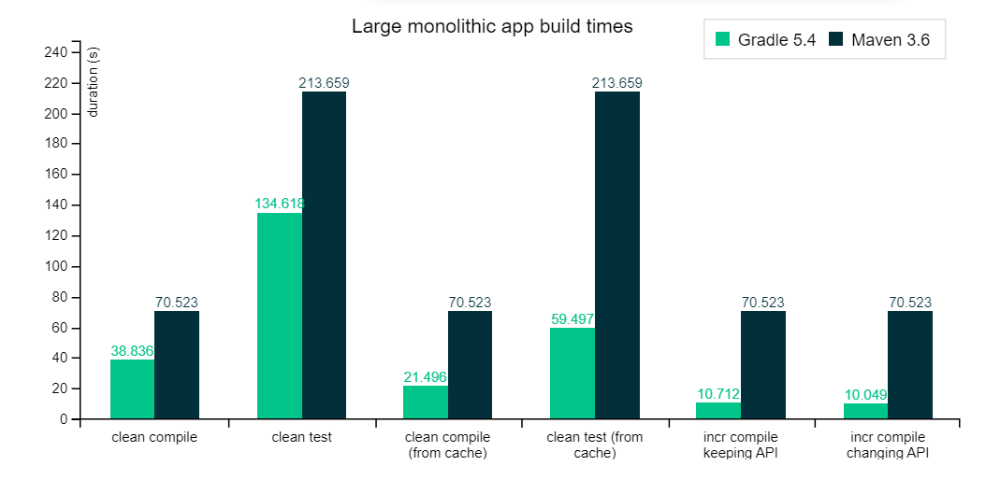
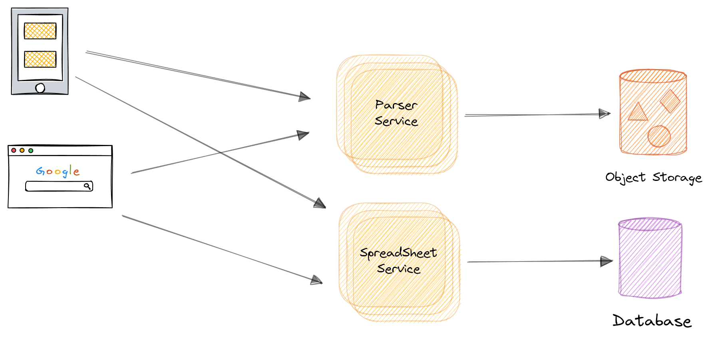
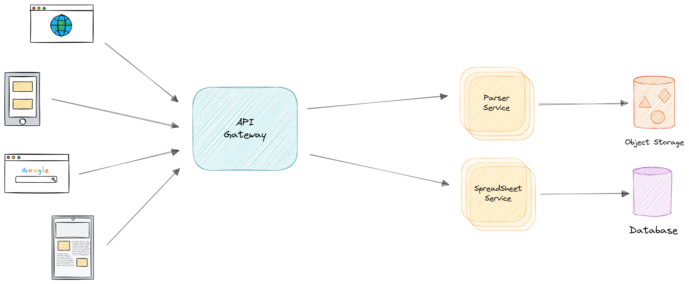
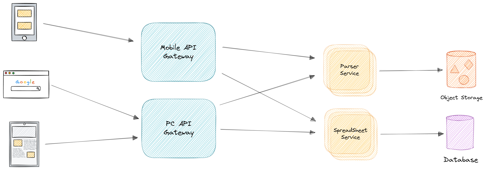
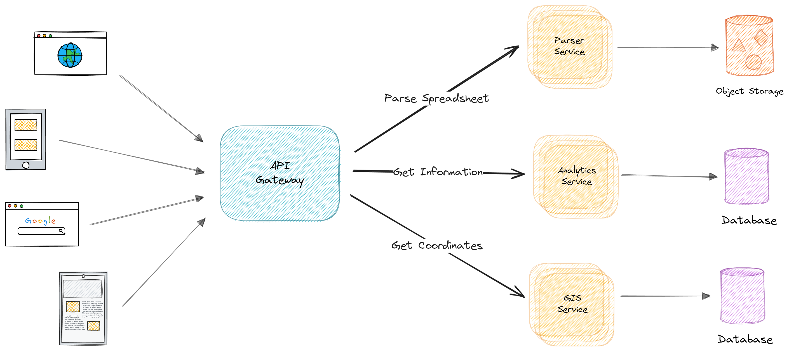

# Теоретическая часть

## Системы автоматической сборки

В свете быстрого развития современных информационных технологий и повышенных требований к
эффективности программных систем, внедрение интегрированных средств автоматизации сборки является
неотъемлемым этапом в процессе разработки программного обеспечения. В данной главе рассматривается
важная составляющая инфраструктуры разработки - интеграция системы автоматической сборки в
контексте платформы аналитики исторических данных с использованием микросервисной архитектуры.

Gradle представляет собой мощный инструмент для автоматизации процессов сборки и управления
зависимостями в проектах различной сложности. Его гибкость и расширяемость позволяют эффективно
управлять процессом сборки как небольших приложений, так и крупных программных комплексов. В
контексте платформы аналитики исторических данных, где требуется обеспечить высокую
производительность и надежность при обработке больших объемов информации, внедрение Gradle
представляется важным шагом для оптимизации процесса разработки и поддержки программного
обеспечения.

Данная глава направлена на анализ методов интеграции системы автоматической сборки Gradle
в существующую инфраструктуру обслуживания микросервисов платформы аналитики исторических данных. В
частности, рассматриваются вопросы настройки Gradle для удовлетворения требований по сборке,
тестированию и развертыванию микросервисов, а также оптимизации процесса разработки и управления
зависимостями. Предполагается, что результаты данного исследования смогут служить основой для
разработки эффективной и масштабируемой инфраструктуры сборки в рамках платформы аналитики
исторических данных, способствуя повышению производительности и надежности разрабатываемых
приложений.

### Обоснование выбора Gradle

В данном разделе обосновывается выбор системы автоматической сборки Gradle в качестве основного
инструмента для интеграции в инфраструктуру разработки на платформе аналитики исторических данных.

Рассматриваются основные преимущества и функциональные возможности Gradle, а также адаптация данной
системы к требованиям и особенностям разрабатываемого программного комплекса. Рассматриваются
факторы, влияющие на принятие данного решения.

#### Системы автоматизированных сборок

Gradle — это система автоматизации сборки с открытым исходным кодом, в которой используются те же
идеи, что и в Apache Maven и Apache Ant. Он использует предметно-ориентированный язык, основанный на
компьютерном языке Groovy или Kotlin, в отличие от Apache Maven, настройка проекта которого
использует XML.
[1](/additionally/Литература.md#gradle-vs-maven)

#### Основные различия

Существуют существенные различия в подходах к построению двух систем. Gradle основан на модели сети
зависимостей задач, где каждая задача представляет собой исполняемый объект, выполняющий
определенные действия. В отличие от этого, в Maven стадии проекта связаны с целями, которые
функционируют аналогично задачам в Gradle как объекты, осуществляющие выполнение работы.

#### Производительность

Оба фреймворка обеспечивают возможность одновременного выполнения множества сборок модулей с учетом
аспектов производительности. Gradle, в частности, обладает возможностью проведения инкрементных
сборок, так как он способен определить, какие задачи были изменены. Кроме того, Gradle обладает
рядом выдающихся характеристик производительности, среди которых следует выделить:

1. Инкрементальная компиляция классов Java, что позволяет значительно сократить время сборки за счет
   перекомпиляции только тех классов, которые были изменены.

2. Компиляция предотвращения для Java, предоставляющая возможность быстрого обнаружения ошибок в
   коде на этапе компиляции.

3. API для дополнительных подзадач, что обеспечивает гибкость в настройке и расширении процесса
   сборки.

4. Демон компилятора, который значительно ускоряет процесс компиляции за счет сохранения в памяти
   некоторых результатов предыдущих компиляций.

На рисунке () представлен сравнительный тест производительности автоматизированной сборки
одинаковых проектов и прохождение тестов. [2](/additionally/Литература.md#a-detailed-comprasion)

## API Gateway. Маршрутизация и фильтрация

В нынешних стандартах информационных технологий существует понятие цифровой экосистемы, требующей
эффективной обработки и управления потоком данных. В контексте цифровой экосистемы появляется
надобность в инструментарии, способном на рационализацию и организацию потока данных между
клиентами и целевыми микросервисами. API Gateway становится одним из важных решений в данном
контексте.

API Gateway - инструмент, предоставляющий функциональность машрутизации, фильтрации и авторизации
трафика. Он является одним из важных компонентов в рамках микросервисной архитектуры,
способствующий организации внутренних и внешних взаимодействий между компонентами системы.

### Прямое взаимодействие клиента и сервиса

В контексте современных подходов к разработке миркосервисных платформ в некоторых случаях
рассматривается возможность прямого взаимодействия клиента с микросервисом. Этот подход
предполагает, что клиентское приложение
способно напрямую отправлять запросы к отдельным микросервисам без посредника между ними. В данном
сценарии, каждый микросервис предоставляет общедоступный эндпоинт, часто с индивидуальным
TCP-портом, что обеспечивает прямой доступ к конкретному сервису.

При таком подходе первостепенно возникает необходимость в прозрачном механизме для управления
трафиком и обеспечения безопасности
взаимодействия между клиентом и микросервисами. В данном контексте, могут быть задействованы
дополнительные
инструменты, например балансировщики нагрузки или ADC, которые помогают
обеспечить не только равномерное распределение запросов между микросервисами, но и обеспечивают
уровень базовый уровень защиты, к примеру использование при запросах
протокола SSL для шифрования соединения.

Однако, при создании масштабных приложений на основе микросервисов, особенно при взаимодействии с
удаленными мобильными приложениями или веб-приложениями SPA, сталкиваются с
рядом множественных вызовов. При увеличении системы
вызовы требуют минимизации обращений к серверной части для сокращений задержки обращения и расходов
на эксплотацию,
управление сквозными задачами, такими как авторизация и безопасность, а также создание
специализированных дополнительных фасадов для оптимизации работы и разделение бизнес-логики для
различных типов клиентских приложений.

Следовательно, в контексте архитектуры прямого взаимодействия клиент-микросервис, важно учитывать не
только технологические аспекты, но и сложившиеся практики и вызовы, с которыми сталкиваются
разработчики при проектировании и развертывании современных цифровых приложений.

Пример прямой связи клиента и сервиса представлен на рисунке

#### Проблемы подхода

Следует учитывать, что при прямом соединении клиента и отдельных сервисов нелинейно увеличивается
сложность взаимодействия и управления. Связанно это с необходимостью поддержания соединения с
клиентом на протяжении всего запроса, что потенциально увеличивает нагрузку на ресурсы сети.

Ко всему такой подход несет серьезные проблемы с безопасностью, так как отсутствует
централизированный
механизм контроля аунтефикации. Эта проблема несет за собой, в том числе и проблемы поддержания
единого соглашения политики безопасности сервиса из-за необходимости каждого отдельного сервиса
обеспечивать собственную безопасность.

Наконец, прямое взаимодействие усложняет обновление и масштабирование системы. При внесении
изменений в микросервисы или добавлении новых компонентов необходимо обновлять каждое клиентское
приложение, что может быть трудоемким и время затратным процессом.

### API Gateway

Шаблон API Gateway представляет собой концепцию, используемую при разработке и архитектуре
масштабных или комплексных приложений, основанных на архитектуре микросервисов и включающих
несколько клиентских приложений. В контексте данной практики API Gateway представляет собой сервис,
который функционирует как централизованная точка входа для определенных кластеров микросервисов.
Этот шаблон, аналогичный концепции фасада в объектно-ориентированном проектировании, является
составной частью децентрализованных систем.

Следовательно, API Gateway размещается между клиентскими приложениями и микросервисами, действуя в
качестве обратного прокси-сервера, который маршрутизирует запросы от клиентов к соответствующим
сервисам. Тем не менее API Gateway обеспечивает дополнительную функциональность, такую как
аутентификация, SSL и кэширование.

На рисунке ( представлена диаграмма, иллюстрирующая интеграцию
пользовательского
API Gateway в упрощенную схему архитектуры микросервисов.

Важно подчеркнуть, что в представленной схеме используется единый пользовательский сервис API
Gateway, обслуживающий несколько различных клиентских приложений. Это может представлять риск в
плане масштабирования и поддержки, так как сервис API Gateway становится весьма сложным из-за
разнообразных требований клиентских приложений. Это может привести к его увеличению и, в конечном
итоге, превращению в монолитное приложение или сервис. Следовательно, рекомендуется разделение API
Gateway на несколько служб или отдельных API Gateways в соответствии с бизнес-границами и
потребностями клиентских приложений.

Разработка и реализация API Gateway требует осторожного подхода. Объединение всех внутренних
микросервисов приложения в единый API Gateway может привести к нарушению автономии микросервисов и
созданию архитектурного оркестратора, что не рекомендуется.

#### BFF

При разделении уровня API Gateway на несколько компонентов, например, при наличии нескольких
клиентских приложений, основным руководством является создание различных эндпоинтов API Gateways в
соответствии
с типами клиентов. Это может быть реализовано через применение шаблона "Серверная часть для
интерфейса" (BFF), где API Gateway предоставляет специализированный API для конкретного типа
клиентского приложения. 

Для платформ, использующих множество сервисов, важность применения агрегации возрастает, так как
требуется объединение нескольких низкоуровневых вызовов для обеспечения пользовательских функций. В
таких сценариях один вызов к шлюзу для фронтендов (BFF) обычно порождает ряд низкоуровневых вызовов
к разным микросервисам. Примером может послужить приложение для аналитики исторических данных, в
котором
пользователь требует получения списка координат церквей из определенного уезда для визуализации
движения рукописи
за определенный период времени.

С точки зрения оптимизации ресурсов было бы целесообразно осуществлять как можно больше вызовов
параллельно. После завершения начального вызова к сервису "Поиска координат" оптимально выполнять
вызовы других сервисов параллельно, с целью сократить общее время обработки. [10](Литература.md#bff)

### Сравнение популярных решений

Для сравнения API Gateway необходимо определить критерии, по которым будут оцениваться различные решения. Основные
критерии включают производительность, масштабируемость, безопасность, интеграцию с другими сервисами, удобство настройки
и использования, а также сообщество и поддержку.

Сравниваемые решения включают:

1. Spring Cloud Gateway
2. Kong
3. Amazon API Gateway
4. Apigee
5. NGINX

**Производительность**

Spring Cloud Gateway демонстрирует высокую производительность благодаря реактивной архитектуре на основе проекта Spring
WebFlux. Это обеспечивает асинхронную обработку запросов и высокую пропускную способность.

Kong также имеет высокую производительность благодаря использованию NGINX и LuaJIT, что позволяет обрабатывать тысячи
запросов в секунду с низкой задержкой.

Amazon API Gateway интегрирован с AWS инфраструктурой, обеспечивая надежную и масштабируемую производительность. Однако,
для достижения высокой производительности могут потребоваться дополнительные настройки и использование AWS Lambda.

Apigee обладает хорошей производительностью, однако может уступать в сценариях с высокими нагрузками по сравнению с
решениями на основе NGINX.

NGINX известен своей высокой производительностью и низкой задержкой, что делает его популярным выбором для API Gateway.

**Масштабируемость**

Spring Cloud Gateway легко масштабируется в рамках экосистемы Spring Cloud, поддерживая кластеризацию и интеграцию с
различными системами оркестрации, такими как Kubernetes.

Kong поддерживает горизонтальное масштабирование и интеграцию с различными оркестраторами контейнеров, что делает его
подходящим для крупных распределённых систем.

Amazon API Gateway предлагает автоматическое масштабирование в рамках AWS, что позволяет обрабатывать любые объемы
трафика без необходимости управления инфраструктурой.

Apigee предоставляет масштабируемость на уровне предприятия, поддерживая гибкость и высокую доступность.

NGINX, как и Kong, легко масштабируется горизонтально, что позволяет его использовать в крупных распределённых системах.

**Безопасность**

Spring Cloud Gateway поддерживает интеграцию с различными решениями для аутентификации и авторизации, такими как OAuth2
и JWT, а также предоставляет возможности для настройки правил безопасности.

Kong обладает мощными функциями безопасности, включая аутентификацию, авторизацию, SSL/TLS шифрование и контроль доступа
на уровне API.

Amazon API Gateway интегрируется с AWS IAM для управления доступом, а также поддерживает API ключи, OAuth и
пользовательские авторизационные механизмы.

Apigee предлагает широкий набор функций безопасности, включая шифрование, управление доступом и интеграцию с системами
аутентификации.

NGINX обеспечивает базовые функции безопасности и поддерживает расширенные настройки через модули и интеграции с другими
решениями безопасности.

**Интеграция с другими сервисами**

Spring Cloud Gateway тесно интегрирован с экосистемой Spring, что обеспечивает простую интеграцию с микросервисами и
другими компонентами на базе Spring.

Kong поддерживает интеграцию с различными базами данных, системами мониторинга и логирования, а также предоставляет
множество плагинов для расширения функциональности.

Amazon API Gateway интегрируется с различными сервисами AWS, такими как Lambda, DynamoDB, S3 и другие, что делает его
мощным инструментом для построения серверлесс-приложений.

Apigee предлагает интеграцию с различными облачными платформами и сервисами, а также поддерживает гибкие возможности
расширения через API и SDK.

NGINX может интегрироваться с различными сервисами через модули и конфигурации, обеспечивая гибкость в построении
сложных инфраструктур.

**Удобство настройки и использования**

Spring Cloud Gateway предоставляет декларативный способ настройки через YAML или Java-код, что делает его удобным для
разработчиков, знакомых с экосистемой Spring.

Kong предлагает интуитивно понятный интерфейс и мощный API для управления конфигурациями, что упрощает его настройку и
использование.

Amazon API Gateway предоставляет удобный веб-интерфейс и API для управления, но может потребовать времени на освоение
всех возможностей и особенностей настройки в контексте AWS.

Apigee предлагает мощный интерфейс для управления API и инструментами аналитики, что облегчает процесс настройки и
мониторинга.

NGINX требует глубокой настройки через конфигурационные файлы, что может потребовать значительных усилий для оптимальной
настройки и управления.

**Сообщество и поддержка**

Spring Cloud Gateway пользуется поддержкой большого сообщества разработчиков Spring, что обеспечивает доступ к обширной
документации, форумам и ресурсам.

Kong имеет активное сообщество и предоставляет коммерческую поддержку через Kong Enterprise.

Amazon API Gateway получает поддержку от AWS, включая обширную документацию, обучающие материалы и техподдержку.

Apigee обладает сильной поддержкой от Google, включая документацию, обучающие материалы и коммерческую поддержку.

NGINX имеет большое сообщество пользователей и разработчиков, а также коммерческую поддержку через NGINX Plus.

**Вывод**

Spring Cloud Gateway, благодаря своей высокой производительности, простоте интеграции с экосистемой Spring, мощным
возможностям настройки и широкому сообществу, является предпочтительным выбором для проектов, использующих стек
технологий Spring. Он обеспечивает гибкость, масштабируемость и безопасность, необходимые для современных микросервисных
архитектур, и, таким образом, заслуженно выходит победителем в этом сравнении.

### Spring Cloud Gateway

Для проекта платформы аналитики исторических данных перед API Gateway выдвигаются определенные
требования:

1) Должен маршрутизировать запросы в различные модификации сервисов в зависимости от клиента.
2) Поддержка Oauth 2.0 для передачи информации о пользователи в API сервисы
3) Метрики для оценки загрузки сервиса и задержки ответов.
4) Логирование запросов и ответов.

Spring Cloud Gateway успешно справляется со всеми выдвигаемыми требованиями.
Тем не менее его не мало важное преймущество -- работа в режиме non-blocking.

#### Non-blocking Spring Cloud Gateway

Неблокирующая схема, реализованная вне контекста сервлетов и функционирующая на основе Netty,
основанного на проекте Reactor, представляет собой асинхронный фреймворк, ориентированный на event
loop'ы, а не на статически определенное количество потоков. В данной схеме может
присутствовать только один поток. Каждый процессорный поток управляет одной петлей, в которой
сосредоточены каналы, принимающие входящие TCP-соединения, декодирующие HTTP-запросы (это происходит
быстро) и передающие их дальше.

Запрос поступает через HTTP в канал, затем через петлю событий и далее в приложение WebFlux (
реактивный подход к написанию приложений Spring, основанный на Project Reactor) в виде объекта
ServerHttpRequest - нового объекта, заменяющего HttpServletRequest. Это происходит неблокирующим
образом: петля событий получает событие из канала, обрабатывает его, создает флаг ожидания
ответа, отправляет его дальше по цепочке и готова снова принимать запросы. WebFlux оборачивает его в
ServerWebExchange, который содержит в себе и запрос, и ответ, и передает их дальше по цепочке до
WebClient - того же HttpClient, но способного работать асинхронно.

Таким образом, получается аналог контекста сервлетов, но уже работающий в неблокирующем режиме, с
использованием реактивных операторов. Ко всему же, все происходит асинхронно, так что даже при
наличии только одного процессорного потока все будет
функционировать. [11](Литература.md#spring-cloud-gateway)

#### Circuit breaker pattern

В процессе обработки запросов микросервсисы часто взаимодействуют друг с другом. Когда один сервсис
синхронно вызывает другой, существует вероятность того, что второй сервис будет недоступна или его
задержка будет настолько велика, что пользование им станет практически невозможным. Это может
привести к неэффективному использованию ресурсов, например, потоков, которые могут быть
заблокированы вызывающей стороной в ожидании ответа от другой службы. Такие ситуации могут привести
к истощению ресурсов и, в конечном итоге, вызвать неспособность обработки других запросов вызывающей
службой. Кроме того, сбой одной службы может потенциально повлиять на работу других служб в рамках
всего приложения. [12](Литература.md#circuit-breaker)

Встает вопрос о необходимости предотвращения распространения сбоев одних сервисов на другие.

Для обеспечения взаимодействия клиента службы с удаленной службой необходимо использовать
прокси-сервер, функционирующий по аналогии с электрическим выключателем. При достижении
определенного порогового значения последовательных сбоев происходит автоматическое срабатывание
выключателя. В течение установленного периода ожидания все попытки обращения к удаленной службе
завершаются неудачей. По истечении данного времени автоматический выключатель пропускает
ограниченное количество тестовых запросов. В случае успешного завершения данных запросов выключатель
восстанавливает нормальный режим работы. Однако, если тестовые запросы завершаются неудачно,
происходит повторный запуск периода ожидания, и цикл
возобновляется. [13](Литература.md#microservice-pattern)

Такой подход имеет и минусы из-за неправильного подбора значения тайм-аута из-за чего в следствии
создаются ложные срабатывания и дополнительные задержки.

## Сервер конфигураций

Внедрение сервера конфигурации в инфраструктуру микросервисов обладает значительной важностью, что обусловлено рядом
факторов, влияющих на стабильность, управляемость и масштабируемость систем.

Во-первых, сервер конфигурации позволяет централизованно управлять настройками множества микросервисов. В условиях,
когда каждый микросервис может иметь свои уникальные параметры, централизованное управление конфигурациями обеспечивает
консистентность и согласованность между различными компонентами системы. Это особенно критично в распределенных
системах, где конфигурационные изменения должны оперативно и синхронно применяться ко всем компонентам.

Во-вторых, централизованное хранение конфигураций облегчает процесс обновления и развертывания микросервисов. Внедрение
сервера конфигурации позволяет динамически изменять параметры конфигурации без необходимости перезапуска самих
микросервисов. Это сокращает время простоя системы и повышает её доступность, что важно для бизнес-критичных приложений.

В-третьих, сервер конфигурации улучшает безопасность системы. Конфиденциальные данные, такие как ключи API и пароли,
могут храниться в зашифрованном виде и предоставляться только авторизованным микросервисам. Это снижает риск утечек
данных и упрощает управление доступом к чувствительной информации.

Четвертое значительное преимущество - улучшение масштабируемости. С ростом количества микросервисов и их экземпляров,
управление конфигурацией становится всё более сложной задачей. Сервер конфигурации позволяет легко масштабировать
системы, обеспечивая быстрый и гибкий доступ к необходимым параметрам конфигурации независимо от числа микросервисов.

Наконец, внедрение сервера конфигурации способствует лучшей отслеживаемости и управляемости изменений конфигураций.
Введение версионирования конфигурационных файлов позволяет отслеживать историю изменений, что облегчает диагностику и
устранение неполадок. Это обеспечивает прозрачность и контроль над изменениями в системе, что важно для поддержания её
стабильности и надежности.

Таким образом, сервер конфигурации является одним из ключевых компонентов современной архитектуры микросервисов,
способствующим
повышению эффективности управления, безопасности, масштабируемости и стабильности системы.

## **Выбор сервера конфигурации**

### Критерии выбора сервера конфигурации

При выборе сервера конфигурации для платформы анализа исторических данных необходимо учитывать ряд ключевых критериев,
которые помогут обеспечить надежную и эффективную работу всей инфраструктуры.

Первым критерием можно выделить необходимость в высокой доступности, то есть сервис должен обладать механизмами
автоматического
восстановления и способностью к горизонтальному масштабированию, чтобы минимизировать время простоя.
Следующим фактором при выборе должна быть способность обеспечения минимальных задержек при доступе к конфиг файлам,
а также возможность поддержки различных форматов файлов, например `json`, `yaml` и другие.

Не стоит забывать и про лицензию для использования. Необходимо перед использованием ознакомиться с условиями
лицензирования и возможностью использования сервера конфигурации в коммерческих и некоммерческих проектах.

Также должны поддерживаться методы шифрования конфигураций как в состоянии потока, так и при передаче.

Опциональным условием будет наличие активного сообщества разработчиков у проекта, потому наличие такого сообщества,
способно предоставить обновление или улучшение продукта.

### Сравнение популярных решений

Для сравнения популярных решений для управления конфигурацией и сервисами в распределённых системах рассмотрим три
наиболее часто используемых инструмента: Consul, etcd и Spring Cloud Config. Каждый из этих инструментов имеет свои
особенности, преимущества и недостатки, которые будут проанализированы в данной теме.

#### Consul

**Описание:**
Consul — это распределённая система управления конфигурациями, обнаружения сервисов и организации сервисной сети (
service mesh), разработанная компанией HashiCorp. Consul предоставляет функционал для регистрации сервисов, проверки их
состояния, распределённого хранения конфигураций и автоматизации сетевого взаимодействия между сервисами.

**Преимущества:**

1. **Обнаружение сервисов:** Consul автоматически обнаруживает и регистрирует сервисы, что облегчает управление сложными
   инфраструктурами.
2. **Проверка состояния:** Встроенные механизмы health-check позволяют отслеживать состояние сервисов в реальном
   времени.
3. **Ключ-значение хранилище:** Consul использует KV-хранилище для распределённого хранения конфигураций.
4. **Service Mesh:** Consul поддерживает функции сервисной сети, включая управление сетевыми политиками и мидлварное
   шифрование.

**Недостатки:**

1. **Сложность настройки:** Конфигурация и интеграция Consul может быть сложной, особенно в больших кластерах.
2. **Ресурсоёмкость:** Требования к ресурсам для поддержания Consul-кластера могут быть высокими, что ограничивает его
   использование в небольших проектах.

#### etcd

**Описание:**
etcd — это распределённое хранилище конфигураций, ориентированное на консенсус, разработанное CoreOS. Оно используется в
различных системах, таких как Kubernetes, для хранения конфигурационных данных и метаданных.

**Преимущества:**

1. **Согласованность данных:** etcd обеспечивает строгое согласование данных благодаря алгоритму Raft.
2. **Высокая производительность:** Высокая производительность и низкая задержка доступа к данным.
3. **Простота:** Простая и лёгкая в использовании API для операций с данными.
4. **Интеграция с Kubernetes:** Является основным хранилищем конфигураций для Kubernetes, что обеспечивает глубокую
   интеграцию и стабильность.

**Недостатки:**

1. **Ограниченный функционал:** В отличие от Consul, etcd не предоставляет встроенные механизмы для обнаружения сервисов
   и проверки их состояния.
2. **Сложность управления:** Управление кластером etcd требует тщательного планирования и мониторинга, особенно в
   больших масштабах.

#### Spring Cloud Config

**Описание:**
Spring Cloud Config — это инструмент для управления конфигурациями в облачных приложениях, входящий в экосистему Spring.
Он позволяет централизованно управлять конфигурационными файлами и изменениями конфигураций для различных приложений.

**Преимущества:**

1. **Интеграция с Spring:** Глубокая интеграция с экосистемой Spring облегчает использование в Spring-приложениях.
2. **Централизованное управление:** Позволяет централизованно управлять конфигурациями для множества приложений.
3. **Поддержка версионирования:** Интеграция с системами контроля версий (такими как Git) позволяет отслеживать
   изменения конфигураций и возвращаться к предыдущим версиям.

**Недостатки:**

1. **Ограниченная функциональность:** Основной фокус на управление конфигурациями, без дополнительных функций, таких как
   обнаружение сервисов или управление сетями.
2. **Зависимость от Spring:** Оптимизирован для использования в Spring-приложениях, что может ограничивать его
   применение в других технологиях.

### Сравнительный анализ

**Функциональные возможности:**

- Consul предлагает наиболее широкий спектр возможностей, включая обнаружение сервисов, проверку их состояния и
  управление сетевой политикой.
- etcd специализируется на высокопроизводительном, согласованном хранении данных.
- Spring Cloud Config фокусируется на управлении конфигурациями в приложениях, интегрированных с Spring.

**Простота использования:**

- Spring Cloud Config является наиболее простым в использовании для разработчиков, работающих с экосистемой Spring.
- Consul и etcd требуют более сложной настройки и управления, особенно в крупных кластерах.

**Производительность и масштабируемость:**

- etcd демонстрирует высокую производительность и низкую задержку, что делает его предпочтительным для хранения
  критически важных данных.
- Consul и Spring Cloud Config могут иметь более высокие накладные расходы в зависимости от используемых функций и
  архитектуры.

### Заключение

Выбор инструмента для управления конфигурациями и сервисами в распределённых системах зависит от конкретных требований
проекта и архитектуры системы. Consul подходит для комплексных систем с необходимостью управления сетевой политикой и
обнаружения сервисов. etcd является оптимальным выбором для высокопроизводительного и надёжного хранения данных. Spring
Cloud Config идеален для централизованного управления конфигурациями в Spring-приложениях.

